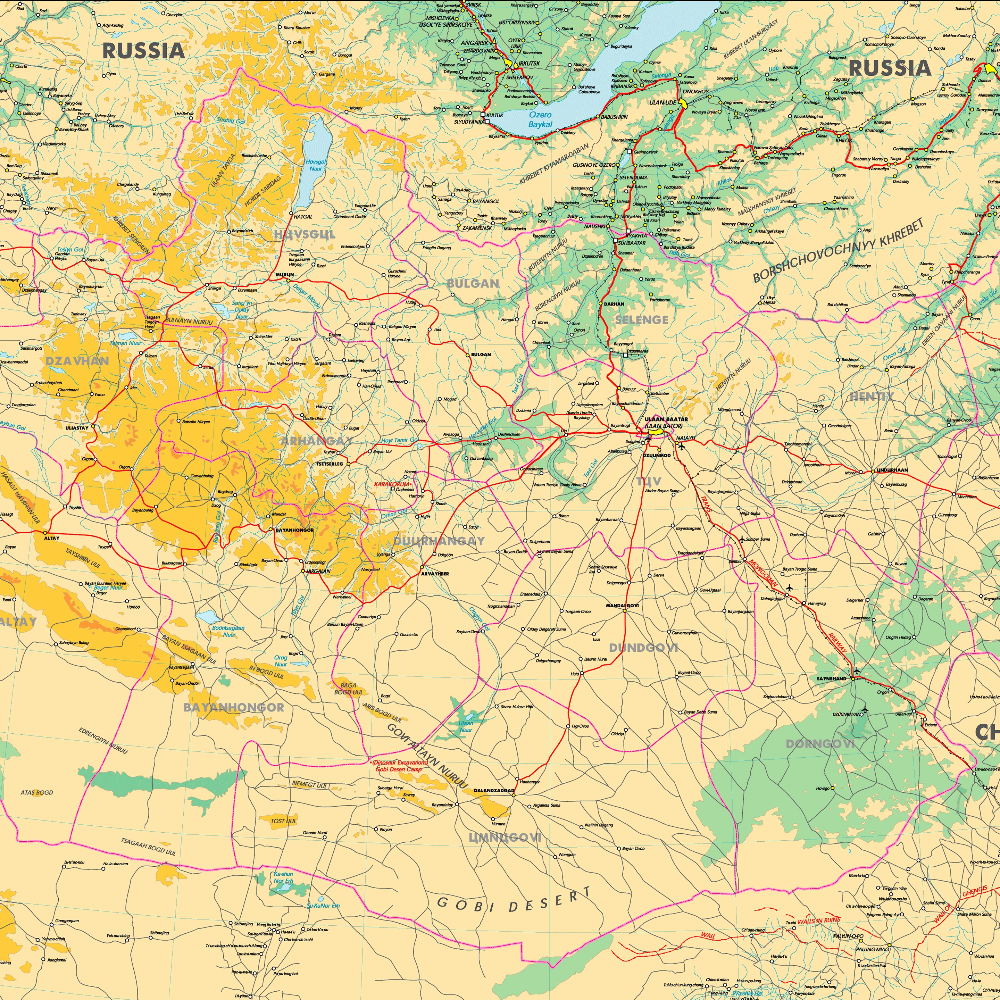

# PinchZoomPan Library

This library uses AngularJS and HammerJS to implement pinch-to-zoom, panning/dragging features on any image or SVG. It also make sure pinch zoom area keeps centered between the two fingers.

## Features
* Pinch To Zoom
* Dragging/Panning
* Supports SVG as well as png/jpeg images.
* Supports all major browsers e.g. CHROME, FIREFOX, SAFARI, IE10+ and other webkit browsers

## Dependencies
* [AngularJS](https://angularjs.org/)
* [HammerJS](http://eightmedia.github.io/hammer.js/)
* [jQuery](http://jquery.com/download/)

## How to use

  Include all required dependencies e.g. jQuery, AngularJS, HammerJS
```javascript
  <script src="jquery-1.10.2.min.js"></script>
  <script src="angular.min.js"></script>
  <script type="text/javascript" src="hammer.min.js"></script>
```

  [OPTIOANL] Include HammerJS external plugin to fake pinch-zoom behaviour on desktop browsers
```javascript
  <script type="text/javascript"  src="hammer.fakemultitouch.js"></script>
  <script type="text/javascript">
        Hammer.plugins.fakeMultitouch();
  </script>
```

  Include the AngularJS-HammerJS directive and PinchZoomPan library file
```javascript
  <script type="text/javascript" src="angular-hammer.js"></script>
  <script src="pinchzoompan.js"></script>
```

  Now in index.hmtl( or in any other html file) use the plugin as follows
```javascript
  <body ng-app="pinchZoomPan">
    <div id="wrapper" data-ng-controller="pinchZoomPanController" hm-transformstart = "svgHandler($event)" hm-transform = "svgHandler($event)" hm-transformend = "svgHandler($event)" hm-dragstart = "svgHandler($event)" hm-drag = "svgHandler($event)" hm-dragend = "svgHandler($event)" hm-options="{tap_always: false}">
                
    </div>
  </body>
```
    
## Authors
* Asim Bashir Bhatti

Special Thanks to Applejacko

Copyright::2014, Confiz. (http://www.confiz.com)
